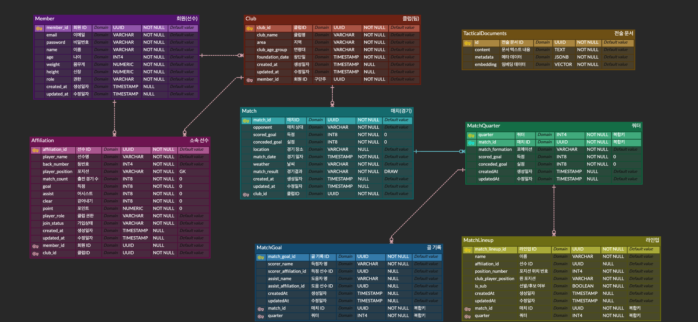
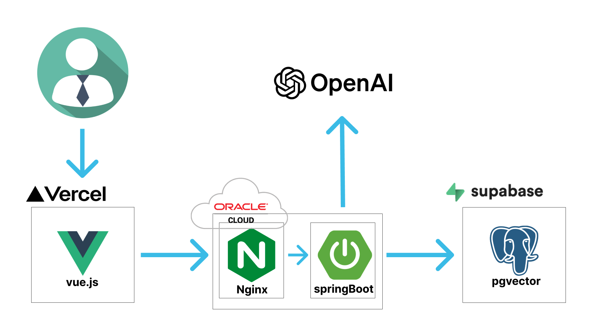

> 아마추어 축구팀을 위한 경기·선수 기록 관리 및 AI 기반 전술 지원 플랫폼

---

## 📋 목차 (Table of Contents)

- [프로젝트 개요](#-프로젝트-개요-project-overview)
- [기술 스택](#-기술-스택-tech-stacks)
- [프로젝트 구조](#-프로젝트-구조-directory-structure)
- [ERD](#-erd)
- [시스템 아키텍처](#-시스템-아키텍처-architecture-diagram)
- [트러블 슈팅](#-트러블-슈팅-trouble-shooting)
- [설치 및 실행](#-설치-및-실행-방법-getting-started)
- [API 명세](#-api-명세-api-documentation)

---

## 📌 프로젝트 개요 (Project Overview)

### 🎯 프로젝트명 및 목적

> **아마추어 축구팀의 기록 데이터를 기반으로  
> 전술·라인업 의사결정을 보조하는 백엔드 중심 플랫폼**

**Karman**은 아마추어 축구팀의  
경기 일정, 선수 기록, 팀 운영 데이터를 관리하고  
이를 실제 전술·라인업 판단에 활용할 수 있도록 설계된 프로젝트입니다.

서비스명 *Karman*은  
축구에서 흔히 말하는 *무회전 슛*의 비행 궤적을 설명한  
**카르만 와류(Kármán vortex street)** 이론에서 착안했습니다.

- 공의 궤적이 예측하기 어려운 것처럼
- 축구 역시 수치화하기 어렵고 변수 많은 스포츠이지만

그 안에서도  
**데이터를 통해 더 나은 선택을 시도해볼 수 있지 않을까**라는 생각에서  
이 프로젝트를 시작하게 되었습니다.

---

### 🚩 프로젝트를 시작하게 된 배경

기존의 아마추어 팀 관리 애플리케이션을 사용하며 느낀 점은 다음과 같았습니다.

- 기록과 데이터는 꾸준히 쌓이지만
- 실제 팀 운영이나 전술 판단에는 적극적으로 활용되지 못함

이 프로젝트는  
단순히 새로운 서비스를 만드는 것보다는,  
제가 좋아하는 **축구라는 도메인을 기반으로**  
기존 서비스가 제공하지 못하는 방향으로  
**직접 기능을 확장하고 개선해보는 과정**에 가깝습니다.

그 과정에서 자연스럽게,

- 도메인 중심 설계(DDD)에 대한 이해를 시도해보고
- 그동안 모호하게 사용하던 **Java, Spring 기반 기술들의 개념을 다시 점검**하며
- 기능이 늘어나고 데이터가 쌓일 때 발생하는  
  **구조적·로직적 문제를 직접 마주해보고 싶었습니다.**

---

### 🌱 프로젝트를 통해 기대했던 경험

- 축구 클럽, 선수, 경기라는 도메인을 기준으로  
  **도메인 중심 구조로 시스템을 설계하고 구현해보는 경험**
- 단순 CRUD를 넘어서  
  기능 확장 과정에서 발생하는 **설계 고민과 리팩터링 경험**
- 명확한 성능 목표를 정해두기보다는,  
  실제 구현 과정에서 마주한 **성능 이슈를 분석하고 구조적으로 개선해보는 경험**
- 기존 서비스에는 없던 기능을  
  **LLM, RAG 같은 기술을 활용해 직접 붙여보며 확장해보는 시도**
- 결과적으로,  
  *“기술을 사용했다”* 가 아니라  
  **내가 사용하는 기술을 이해하고 설명할 수 있는 상태가 되는 것**

---

### ⭐ 핵심 기능

- **클럽 관리**
    - 클럽 생성, 수정, 삭제, 가입, 탈퇴
    - 클럽 멤버 및 선수(Affiliation) 관리

- **경기 및 기록 관리**
    - 경기(Match) 기록 저장 및 데이터 조회
    - 쿼터별 경기 기록 관리
    - 선수 기록 누적 및 조회

- **데이터 기반 AI 기능**
    - 선수 데이터 기반 **라인업 추천**
    - 축구 전술 문서를 벡터화하여  
      질문에 근거 기반 답변을 제공하는  
      **RAG 전술 질의응답(Chatbot Coach)**

---

### 🧭 이 프로젝트의 성격

이 프로젝트는  
처음부터 명확한 완성형 서비스를 목표로 하기보다는,

> 좋아하는 도메인을 기반으로  
> 실제 사용할 수 있는 서비스를  
> **내 기준으로 더 나아지게 만들어보는 과정**

에 가깝습니다.

그 과정에서 발생한  
설계 고민, 성능 이슈, 기술 선택의 이유를  
하나씩 정리하고 개선해 나가는 것을 목표로 하고 있습니다.

---

## 🛠 기술 스택 (Tech Stacks)

### Backend

[]
[]
[]
[]
[]

### DB & AI

[]
[]
[]

### Infra

[]
[]
[]

---

## 📂 프로젝트 구조 (Directory Structure)

```
Karman/
├── gradle/
│   └── wrapper/
├── src/
│   ├── main/
│   │   ├── java/com/project/Karman/
│   │   │   ├── config/                 # 설정
│   │   │   │   ├── jwt/                # JWT 필터, 토큰 제공자
│   │   │   │   ├── security/           # Spring Security, CORS, 핸들러
│   │   │   │   └── WebConfig.java
│   │   │   ├── controller/             # REST API 엔드포인트
│   │   │   │   ├── AuthController.java
│   │   │   │   ├── ClubController.java
│   │   │   │   ├── LineupController.java
│   │   │   │   ├── MatchController.java
│   │   │   │   ├── MemberController.java
│   │   │   │   └── TacticsController.java
│   │   │   ├── domain/                 # 도메인 모델
│   │   │   │   ├── entity/             # Club, Match, Member, Affiliation 등
│   │   │   │   ├── enums/              # ClubAgeGroup, MatchFormation 등
│   │   │   │   └── vo/                 # MatchScoreDelta, PlayerStatsDelta
│   │   │   ├── dto/
│   │   │   │   ├── batch/              # 배치 처리용 DTO
│   │   │   │   ├── request/            # API 요청 DTO
│   │   │   │   └── response/           # API 응답 DTO
│   │   │   ├── exception/              # 전역 예외 처리
│   │   │   ├── repository/             # JPA, JdbcTemplate (Batch)
│   │   │   ├── service/                # 비즈니스 로직, Mapper
│   │   │   └── KarmanApplication.java
│   │   └── resources/
│   │       ├── application.yml
│   │       └── *.json
│   └── test/
│       └── java/com/project/Karman/
├── build.gradle
├── settings.gradle
├── .env.example
└── README.md
```

---

## 💾 ERD



---

## 🏗 시스템 아키텍처 (Architecture Diagram)



---

## ⚡ 트러블 슈팅 (Trouble Shooting)

### 🔎 성능 개선 요약

| 이슈                 | 원인                                        | 해결 방안                                  |
|--------------------|-------------------------------------------|----------------------------------------|
| 쿼터 생성/수정 API 성능 저하 | Cascade / Dirty Checking 기반 다건 처리로 RTT 누적 | 증분 계산 구조 + JDBC Batch / Bulk Delete 적용 |
| 라인업/골 대량 INSERT    | 다건 INSERT를 단건 JPA 저장으로 처리                 | Batch Insert 적용                        |

---

### 📌 대표 사례 1. 쿼터 생성/수정 API 성능 개선 (v0 → v2)

**문제**
> - 쿼터 생성/수정 시 선수 기록, 쿼터 정보, 경기 통계 등 다수의 연관 데이터가 한 요청에서 처리되며 응답 시간이 수 초 단위로 증가
> - Cascade / Dirty Checking 기반 처리로 다건 INSERT·UPDATE·DELETE가 반복 실행되어 **DB Round Trip(RTT)** 이 누적됨

**해결**
> - 전체 재계산 방식 → **변경 전/후 차이만 반영하는 증분 계산 구조**로 리팩터링 (`v1`)
> - 대량 쓰기 구간에서 JPA 의존 제거 → **JDBC Batch Insert/Update + Bulk Delete** 적용 (`v2`)
> - DB Round Trip 최소화

**결과**
> - 쿼터 생성: `2745ms(v0) → 678ms(v2)`
> - 쿼터 수정: `3891ms(v0) → 704ms(v2)`
> - **약 75~80% 성능 개선**

📎 관련 PR 링크

- [[#19] 성능 개선(v1) 매치 조회/집계 로직 개선](https://github.com/atto08/Karman/pull/19)
- [[#20] 성능 개선(v2) JDBC Batch 기반 대량 처리 최적화](https://github.com/atto08/Karman/pull/20)

---

### 📌 대표 사례 2. 성능 개선 이후 발생한 데이터 정합성 이슈

**문제**
> - 성능 개선(v2) 이후 쿼터 수정 시 상세 기록은 반영되었으나, **경기 전체 스코어가 갱신되지 않는 정합성 문제**가 발생

**해결**
> - Bulk Delete 실행 시 영속성 컨텍스트가 조기 초기화되며 변경 사항이 Flush 전에 유실되는 문제 확인
> - 로직 순서를 **엔티티 수정 → Bulk Delete → Insert** 로 재정렬
> - Bulk Delete 쿼리에 `flushAutomatically = true` 적용하여 삭제 전 변경 사항을 강제 Flush

**결과**
> - 경기 스코어와 상세 기록 간 **데이터 정합성 확보**

📎 관련 PR

- [[#21] 쿼터 수정 시 Match/MatchQuarter 스코어 미반영 문제 해결](https://github.com/atto08/Karman/pull/21)

---

### 💡 기술 의사결정 (Technical Decisions)

### 선수(Affiliation) 식별자 설계 변경

**문제**
> - 초기 설계에서 Affiliation을 `(clubId, memberId)` 복합키로 구성하여 “한 클럽에 한 멤버는 하나의 선수”라는 가정을 전제로 구현

**해결**
> - Affiliation PK를 **단일 식별자(id)** 로 변경
> - `clubId`, `memberId`는 비즈니스 키로 관리
> - 용병/비회원 선수(memberId 없음) 케이스까지 포함해 **도메인 확장성을 고려한 설계로 개선**

---

## 🚀 설치 및 실행 방법 (Getting Started)

### 1️⃣ Requirements

| 항목          | 버전           |
|-------------|--------------|
| Java        | 17           |
| Spring Boot | 3.5.4        |
| PostgreSQL  | 15+          |
| pgvector    | Extension 필요 |
| OpenAI      | API Key 필요   |

---

### 2️⃣ 프로젝트 클론

```bash
git clone https://github.com/atto08/Karman.git
cd Karman
```

---

### 3️⃣ PostgreSQL 및 pgvector 설정

PostgreSQL 데이터베이스를 생성한 뒤, Vector 검색 기능 사용을 위해 `pgvector` 확장을 활성화합니다.

```sql
CREATE DATABASE karman;

\c karman;

CREATE EXTENSION IF NOT EXISTS vector;
```

> PostgreSQL 15 이상에서 `pgvector` 확장이 필요합니다.

---

### 4️⃣ 환경 변수 설정

프로젝트 루트 경로에 `.env` 파일을 직접 생성합니다.

```bash
touch .env
```

`.env` 파일을 열어 아래와 같이 수정합니다.

```env
# Database Configuration
DB_URL="db-url"
DB_NAME="db-name"
DB_USERNAME="username"
DB_PASSWORD="password"

# OpenAI API
OPENAI_API_KEY=api_key

# JWT Secret
JWT_SECRET=jwt-secret
```

---

### 5️⃣ 애플리케이션 실행

Gradle Wrapper를 사용하여 실행합니다.

```bash
./gradlew bootRun
```

또는 JAR 파일로 실행할 수 있습니다.

```bash
./gradlew build
java -jar build/libs/Karman-0.0.1-SNAPSHOT.jar
```

---

### 6️⃣ 실행 확인

기본 포트 `8080`에서 서버가 실행됩니다.

```bash
curl http://localhost:8080/auth/login \
  -X POST \
  -H "Content-Type: application/json" \
  -d '{"email":"test@example.com","password":"password"}'
```

---

### ☁️ 운영 환경 (Deployment Overview)

| 구성 요소         | 내용                               |
|---------------|----------------------------------|
| Backend       | Oracle Cloud Instance            |
| Reverse Proxy | Nginx (HTTPS 443 → 8080 포워딩)     |
| Database      | Supabase (PostgreSQL + pgvector) |
| AI            | OpenAI GPT-4                     |

---

## 📡 API 명세 (API Documentation)

### 📦 공통 응답 형식 (Common Response Format)

모든 API는 아래와 같은 공통 응답 구조를 따릅니다.

#### ✅ 성공 응답 예시

```json
{
  "message": "로그인 성공",
  "code": 200,
  "data": {
    "accessToken": "{accessToken}"
  }
}
```

#### ❌ 에러 응답 예시

```json
{
  "message": "찾을 수 없는 클럽(팀) 입니다.",
  "code": 404
}
```

### 🔐 인증 정책 (Authentication)

- `/auth/**` 경로를 제외한 모든 API는 JWT 기반 인증이 필요합니다.
- 요청 시 `Authorization: Bearer {ACCESS_TOKEN}` 헤더를 포함해야 합니다.

---

### 🔐 Auth

| Method | URI            | Description  |
|--------|----------------|--------------|
| POST   | `/auth/signup` | 회원가입         |
| POST   | `/auth/login`  | 로그인 (JWT 발급) |

---

### 👤 Member

| Method | URI                 | Description     |
|--------|---------------------|-----------------|
| GET    | `/members/me/clubs` | 내가 가입한 클럽 목록 조회 |

---

### 🏟 Club

#### Club (Aggregate Root)

| Method | URI                           | Description |
|--------|-------------------------------|-------------|
| POST   | `/clubs`                      | 클럽 생성       |
| GET    | `/clubs/{club_id}`            | 클럽 상세 조회    |
| PATCH  | `/clubs/{club_id}`            | 클럽 수정       |
| DELETE | `/clubs/{club_id}`            | 클럽 삭제       |
| GET    | `/clubs/{club_id}/statistics` | 클럽 통계 조회    |
| GET    | `/clubs/{club_id}/members`    | 클럽 멤버 조회    |

#### 👥 Affiliation (Players & Join)

| Method | URI                                               | Description   |
|--------|---------------------------------------------------|---------------|
| POST   | `/clubs/{club_id}/players`                        | 비회원 선수 추가     |
| GET    | `/clubs/{club_id}/players`                        | 선수 목록 조회      |
| GET    | `/clubs/{club_id}/players/selects`                | 라인업 선택용 선수 목록 |
| PATCH  | `/clubs/{club_id}/players/{affiliation_id}`       | 선수 정보 수정      |
| POST   | `/clubs/{club_id}/players/transfers`              | 선수 기록 이관      |
| POST   | `/clubs/{club_id}/join-requests`                  | 클럽 가입 요청      |
| GET    | `/clubs/{club_id}/join-requests`                  | 가입 요청 목록      |
| PATCH  | `/clubs/{club_id}/join-requests/{affiliation_id}` | 가입 요청 상태 변경   |

---

### ⚽ Match

#### Match (Aggregate Root)

| Method | URI                                   | Description |
|--------|---------------------------------------|-------------|
| POST   | `/clubs/{club_id}/matches`            | 경기 생성       |
| GET    | `/clubs/{club_id}/matches`            | 경기 목록 조회    |
| GET    | `/clubs/{club_id}/matches/{match_id}` | 경기 상세 조회    |

#### 🕒 MatchQuarter

| Method | URI                                                      | Description |
|--------|----------------------------------------------------------|-------------|
| POST   | `/clubs/{club_id}/matches/{match_id}/quarters`           | 쿼터 생성       |
| PATCH  | `/clubs/{club_id}/matches/{match_id}/quarters/{quarter}` | 쿼터 수정       |

---

### 🤖 AI

#### Tactics (RAG 기반 전술 질의응답)

| Method | URI                     | Description                     |
|--------|-------------------------|---------------------------------|
| POST   | `/ai/tactics/documents` | 전술 문서 인덱싱 (Vector Store 저장)     |
| POST   | `/ai/tactics/ask`       | 전술 질의응답 (RAG 기반 AI Coach 응답 반환) |

#### Lineup Recommendation

| Method | URI                                  | Description         |
|--------|--------------------------------------|---------------------|
| POST   | `/clubs/{club_id}/lineups/recommend` | 클럽 데이터 기반 AI 라인업 추천 |

---